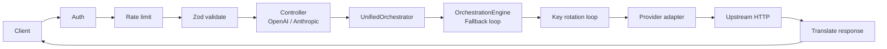

# Waypoint

Waypoint is a single-binary local LLM proxy and gateway. It fronts Google Gemini, Anthropic Claude, OpenAI, and Cloudflare Workers AI behind a single OpenAI- and Anthropic-compatible HTTP surface, plus any OpenAI- or Anthropic-compatible custom endpoint (e.g. OpenRouter, Requesty, local Ollama). It shares a pool of API keys per provider with automatic failover and HTTP-status-driven cooldown. One config file, no database, no sidecar.

## At a Glance

- **Multiple providers, one endpoint pool.** Per-provider key pools rotate with `round-robin` or `fill-first` (the latter favors upstream prompt-cache locality).
- **HTTP-status-driven key lifecycle.** `401`/`403` retire a key permanently; `402`/`408`/`429`/`5xx` apply a cooldown (with exponential backoff for `429`); other `4xx` and transport failures leave the key untouched. Keys auto-reactivate when the timer fires.
- **OpenAI and Anthropic ingress.** Tools, multimodal messages, SSE streaming, and `reasoning_content` are normalized through OpenAI as the hub. On OpenAI ingress, `max_tokens` wins over `max_completion_tokens` when both are present.
- **Cross-protocol egress.** Gemini, Anthropic, OpenAI, Cloudflare Workers AI, and any custom OpenAI- or Anthropic-compatible endpoint (configured with `baseUrl`; e.g. OpenRouter, Requesty, local Ollama).
- **Dry-run.** `/dryrun/...` and `/dryrun/v1/...` mirror the live routes and return what would have been sent upstream, without making the call. Requires `logging.logRequests: true`.
- **Per-request audit logs.** When `logging.logRequests: true`, five files per request land under `logging.requestLogPath`: `01_client_request.json`, `02_provider_request.json`, `03_provider_response.json`, `04_client_response.json`, and `05_event_stream.jsonl` (for streaming). Old folders are pruned automatically — see [Logging Retention](#logging-retention).
- **Operational telemetry.** `GET /health` returns pool and routing state; `GET /metrics` returns Prometheus text. Both are behind the same bearer-token auth as the protocol routes.
- **Single binary, single config.** One process, one YAML, no DB, no daemon.

## How It Works

A request hits the gateway, is authenticated and rate-limited against a per-client sliding window, validated against the Zod schema for its ingress protocol, and translated into the OpenAI-shaped unified model. The UnifiedOrchestrator handles client disconnects and request overrides, then delegates to the OrchestrationEngine which runs the fallback loop. The orchestration engine picks a key from the provider pool, dispatches to the provider adapter, and on failure rotates to the next key, applies the cooldown policy, and falls back to `fallbackModel` when the pool is exhausted. The upstream response is translated back into the ingress protocol's native shape and returned to the client.



The orchestration engine retries on the next available key, applies the cooldown policy on failure, and falls back to `fallbackModel` when the provider pool is exhausted.

## Quickstart

Requires Node.js 24 or newer. Node 24 LTS is the recommended runtime; the CI
matrix also validates against Node 26.

1. Clone, install, copy the example config and env file:

   ```bash
   git clone https://github.com/not-lucky/waypoint.git waypoint
   cd waypoint
   npm install
   cp config.example.yaml config/config.yaml
   cp .env.example .env
   ```

   Fill in the `${...}` placeholders in `.env` with your API keys and client tokens.

2. Start the gateway. `npm run dev` runs under `node --watch` for local development; `npm start` runs the production entry point.

   ```bash
   npm run dev
   ```

3. Sanity-check that the gateway is up:

   ```bash
   curl -sS -H "Authorization: Bearer $OPEN_WEBUI_TOKEN" http://localhost:20128/health
   ```

   Expect a JSON body with a `status` field.

4. Send an OpenAI-shaped request:

   ```bash
   curl -sS http://localhost:20128/v1/chat/completions \
     -H "Authorization: Bearer $OPEN_WEBUI_TOKEN" \
     -H "Content-Type: application/json" \
     -d '{
       "model": "gemini-2.5-pro",
       "messages": [{"role": "user", "content": "Say hi in one word."}]
     }'
   ```

`config.example.yaml` is the authoritative annotated configuration reference; `config/config.yaml` is your live config. Set `WAYPOINT_CONFIG_PATH` to point at any YAML file instead of the default.

## Endpoints

| Method | Path | Notes |
|--------|------|-------|
| `GET`  | `/health` | Bearer-token auth. Returns pool and routing state. |
| `GET`  | `/metrics` | Bearer-token auth. Prometheus text. |
| `GET`  | `/v1/models` (also `/models`) | Bearer-token auth. Format is detected from headers (`Authorization: Bearer` → OpenAI shape; `x-api-key` or `anthropic-version` → Anthropic shape). |
| `POST` | `/v1/chat/completions` (also `/chat/completions`) | Bearer-token auth. OpenAI-shaped body. Set `"stream": true` for SSE. |
| `POST` | `/v1/messages` (also `/messages`) | Bearer-token auth. Anthropic-shaped body. SSE streaming. |
| `POST` | `/dryrun/...` and `/dryrun/v1/...` | Mirror the live routes (`/dryrun/chat/completions`, `/dryrun/messages`, etc.). `logging.logRequests: true` required. |

## Configuration

Copy `config.example.yaml` to `config/config.yaml` (or point `WAYPOINT_CONFIG_PATH` at any YAML file). `${ENV}` placeholders are resolved from the process environment at boot. Configuration is validated using Zod schemas defined in `src/config/` (validator.js, clientValidator.js, gatewayValidator.js, loggingValidator.js, providerValidator.js, and supporting utilities). The example file is the authoritative reference and is annotated inline; the minimum below is all you need to read it.

```yaml
gateway:
  port: 20128
  globalRetryLimit: 3
  httpTimeoutMs: 120000
  cooldown:
    baseSeconds: 30
    maxSeconds: 3600
    serverSeconds: 60
  maxPayloadSize: "10mb"
  routing:
    strategy: "round-robin"
  cors:
    allowedOrigins:
      - "*"

clients:
  - name: "open-webui"
    token: "${OPEN_WEBUI_TOKEN}"
    rateLimit:
      windowMs: 60000
      max: 100

providers:
  gemini:
    keys:
      - "${GEMINI_API_KEY_1}"
    models:
      # Shorthand: a plain string expands to { modelid: "..." }
      - "gemini-2.5-pro"
      # Long form for model options that need more than an id
      - modelid: "gemini-flash-lite-latest"
        temperature: 0.3
        fallbackModel: "openai/gpt-4o"
  local-ollama:
    baseUrl: "http://localhost:11434/v1"
    keys:
      - "dummy-key-required"
    models:
      - "llama3"
```

Reserved provider names (`gemini`, `anthropic`, `openai`, `cloudflare`) MUST NOT carry a `type` field; custom providers MUST set `baseUrl`. Custom providers can optionally specify a `type` field:
- Omitting `type` defaults to `openai-compatible`
- The only other accepted value is `anthropic-compatible`

### Shorthand Model Declarations

Each entry under a provider's `models:` array may be either an object or a string. String entries are expanded to `{ modelid: "<string>" }` before validation, so they work for the simple case of declaring a model id without any extra settings:

```yaml
providers:
  gemini:
    keys:
      - "${GEMINI_API_KEY_1}"
    models:
      - "gemini-2.5-pro"
      - "gemini-2.5-flash"
```

Strings and objects may be mixed freely. Use the object form whenever you need any field other than `modelid` (for example `aliases`, `temperature`, `reasoningEffort`, `overrides`, or `fallbackModel`):

```yaml
providers:
  gemini:
    keys:
      - "${GEMINI_API_KEY_1}"
    models:
      - "gemini-2.5-pro"                                  # shorthand
      - modelid: "gemini-flash-lite-latest"               # long form
        temperature: 0.3
        fallbackModel: "openai/gpt-4o"
```

Shorthand entries are normalized before fallback validation runs, so a `fallbackModel` reference such as `openai/gpt-4o` resolves correctly even when the target provider's `gpt-4o` entry is declared later in the config and written as a string.

See `config.example.yaml` for `logging.*` and the full provider schema.

Cloudflare is also a reserved provider. Unlike the other built-ins, Cloudflare uses the OpenAICompatibleAdapter with special factory logic and requires object-based credentials with both `apiKey` and `accountId` (because the upstream OpenAI-compatible URL is account-scoped).

## Additional Configuration Options

### Gateway Settings

- **globalRetryLimit**: Maximum number of retry attempts for failed upstream calls (optional, positive integer)
- **httpTimeoutMs**: Maximum duration for a single upstream request in milliseconds (optional, positive integer)
- **streamTimeoutMs**: Optional streaming timeout in milliseconds. When set, applies only to streaming calls; non-streaming completions use httpTimeoutMs
- **maxPayloadSize**: Maximum allowed payload size for requests (optional string, e.g., "10mb")
- **routing.strategy**: Key rotation strategy - "round-robin" (distributes load evenly) or "fill-first" (exhausts keys in order for cache locality)

### Model Configuration

Models support advanced configuration options:

- **actualModelId**: The underlying model ID to call upstream (optional, string). Useful for exposing different model IDs to clients while using the same upstream model
- **aliases**: Alternative IDs that can be used to reference this model (optional, array of strings)
- **overrides**: Locked settings that override client-supplied values (optional, object)
- **reasoningSupported**: Whether the model supports reasoning/thinking capabilities (optional, boolean, defaults to `true` unless explicitly set to `false`)
- **reasoningEffort**: Unified reasoning level - one of "minimal", "low", "medium", "high", "xhigh", "max" (optional, string)
- **extractReasoningFromThinkBlocks**: If true, splits assistant content containing thinking/reasoning into `reasoning_content` field (optional, boolean). Can be set at provider or model level
- **extraBody**: Provider-specific parameters (e.g., OpenRouter's provider/plugins fields, Gemini's google_search, Anthropic's metadata) merged directly into outbound payloads (optional, object)
- **allowedExtraBody**: Whitelist of client-supplied parameter keys that are allowed to pass through into `extraBody`. Can be a string `"*"`, an array of strings, or omitted/null (optional, default-deny)

### Provider-Level Settings

Providers can define default settings that apply to all their models unless overridden:

- **extractReasoningFromThinkBlocks**: Provider-level default that models inherit unless explicitly set
- **extraBody**: Provider-level default extra parameters that models inherit unless overridden
- **allowedExtraBody**: Provider-level whitelist that models inherit unless overridden

### Model Settings Inheritance

Model settings can be defined at both provider and model level. Model-level settings override provider-level defaults. The `overrides` field provides locked settings that always take precedence over client-supplied values. Settings that support inheritance include `extractReasoningFromThinkBlocks`, `extraBody`, and `allowedExtraBody`.

### extraBody Precedence and Resolution

The final value of `extraBody` sent upstream is composed from three sources in this strict precedence order (highest priority last):

1. **Provider-level `extraBody`** (config defaults) — applied first as a baseline.
2. **Client-supplied `extraBody`** (request body) — overrides provider defaults per top-level key, but only for keys present in `allowedExtraBody`.
3. **Client-supplied root-level non-standard keys** (e.g. `metadata`, `plugins`, `provider`) — when a key is not a standard routing/request key and is whitelisted, the root-level value is extracted and bundled into the merged `extraBody`, **overriding** any matching key supplied via the explicit `extraBody` object in the same request.

Practical implications:

- A client can send `extraBody.plugins` and a root-level `plugins` in the same request. The root-level value wins for that key.
- Standard routing keys (`model`, `messages`, `stream`, `temperature`, `max_tokens`, `max_completion_tokens`, `tools`, `tool_choice`, `system`) are **never** accepted via `extraBody` even when `allowedExtraBody: '*'` is configured — this prevents clients from bypassing routing or authentication.
- `provider` is whitelisted by default exemption so OpenRouter's `provider: { sort, allow_fallbacks, ... }` routing preferences can be passed through without explicit per-key listing.
- When a key appears in both `allowedExtraBody` (config) and a client-supplied root-level field, the client's value wins.
- If `allowedExtraBody` is `null`/`undefined`, **all** client-supplied extra fields (both root-level and via `extraBody`) are silently stripped.

For nested containers (`extra_body` for Gemini, `metadata` for Anthropic), values are deep-merged so adapter-injected configurations (e.g. `google.thinking_config`) coexist with client-supplied parameters (e.g. `google.google_search`).

## Logging Retention

Two retention caps keep disk usage bounded for long-running deployments. Both are non-negative integers; set either to `0` to disable rotation entirely. Defaults are tuned for production.

### `logging.maxRetainedRequestLogs` (default: 1000)

Caps the number of per-request audit-log folders kept under `logging.requestLogPath`. Folders follow the `<ISO-timestamp>_<id>` pattern; entries that don't match (e.g. operator-uploaded files) are never touched. Pruning runs on the next request: once the count exceeds the cap, the oldest folders (sorted by their ISO prefix) are removed before the new request's folder is created. Below the cap, the prune is a single `readdir` no-op.

### `logging.maxRetainedLogFiles` (default: 1000)

Caps the number of Waypoint session log files kept next to `logging.filePath`. At startup, `configureLogging` opens a fresh per-process file named `<filePath-base>_<session-timestamp><ext>` (e.g. `Waypoint_2026-06-26T15-14-02-123Z.log`). Before opening it, the directory is scanned for matching `<base>_<timestamp><ext>` files and the oldest are removed down to the cap. Non-matching entries (operator notes, manual uploads, unrelated `*.log`) are preserved.

### When to change the defaults

- Raise `maxRetainedRequestLogs` if you need a longer audit window for incident investigation.
- Raise `maxRetainedLogFiles` if you need to compare behaviour across many process restarts.
- Set either to `0` only when an external log shipper is responsible for retention — otherwise disk usage is unbounded.

Full field annotations live in `config.example.yaml`.

## Key Lifecycle & Cooldown

Key state changes are driven by the upstream's HTTP status code. The upstream's exact `code`, `type`, and `message` are passed through to the client unchanged.

| Upstream status | Key action | Cooldown |
|-----------------|-----------|----------|
| `401` | `retire` | none, never reactivated |
| `403` | `retire` | none, never reactivated |
| `402` | `cooldown` | `Retry-After` if present, else `serverSeconds` |
| `408` | `cooldown` | same as `402` |
| `429` | `cooldown` | `Retry-After` if present, else exponential `baseSeconds * 2^(consecutiveFailures - 1)` capped at `maxSeconds` |
| `5xx` | `cooldown` | `Retry-After` if present, else `serverSeconds` |
| Other `4xx` | `none` | no key-state change — the request was wrong |
| Transport failure (no status) | `none` | no key-state change — the request did not reach the provider |

`401` and `403` retire the key permanently because the credential is bad or the account is denied; subsequent calls skip it. `402`, `408`, `429`, and `5xx` apply a cooldown; the key reactivates when the timer fires. `429` uses exponential backoff starting at `gateway.cooldown.baseSeconds` and doubling on consecutive failures up to `gateway.cooldown.maxSeconds`; a non-zero `Retry-After` header wins when present (a `0` means "retry immediately"). Other `4xx` and transport failures leave the key alone — they reflect a bad request or a network problem, not an unhealthy key.

Full policy details in `src/domain/errors/policy.js` and `src/domain/keys/cooldownTracker.js`.

## Error Envelope

Every client-visible failure is rendered in the ingress protocol's native shape. Raw upstream response bodies are **never** returned as the root HTTP body — upstream debugging detail stays in server-side logs only.

OpenAI-shaped ingress (and pre-routing errors such as CORS, body parser, validation):

```json
{
  "error": {
    "code": "rate_limit_exceeded",
    "message": "Rate limit exceeded.",
    "type": "rate_limit_error",
    "param": null
  }
}
```

Anthropic-shaped ingress:

```json
{
  "type": "error",
  "error": {
    "type": "api_error",
    "message": "Rate limit exceeded."
  }
}
```

| Field (OpenAI shape) | Required | Notes |
|-------|----------|-------|
| `code` | yes | Upstream's own error code, copied verbatim. Falls back to `upstream_error` when the upstream supplied none. |
| `message` | yes | Upstream's own error message, copied verbatim. |
| `type` | yes | Provider-style category string (e.g. `rate_limit_error`, `api_error`). |
| `param` | yes | Always `null` for upstream and pool errors. |
| `details` | gateway validation only | Optional array of field-level validation issues. |

| Field (Anthropic shape) | Required | Notes |
|-------|----------|-------|
| `type` | yes | Always `error`. |
| `error.type` | yes | Category string. |
| `error.message` | yes | Upstream's own error message, copied verbatim. |

When the orchestrator sets `Retry-After`, the value is also set on the HTTP response as a `Retry-After` header.

The hub format is OpenAI; upstream errors are projected into the ingress protocol's native envelope by `translateError` in `src/adapters/transforms/index.js` and emitted by `buildClientErrorEnvelope` in `src/domain/errors/envelope.js`. Pre-stream failures return the JSON envelope with the upstream's HTTP status; post-stream failures emit an SSE error frame in the ingress protocol's shape and close the stream (HTTP status remains `200`).

For streaming error frame shapes and the per-provider code catalogue, see `src/domain/errors/envelope.js` and `src/adapters/transforms/response/`.

## Project Layout

Source and test files are camelCase. `src/` follows Clean Architecture principles:

- `src/adapters/` — External interface handling
  - `inbound/` — OpenAI and Anthropic protocol request parsing
  - `outbound/` — Provider-specific HTTP communication (Gemini, Anthropic, OpenAI, etc.)
  - `transforms/` — Cross-protocol request/response/error translation
- `src/application/` — Business logic orchestration
  - `orchestrator.js` — UnifiedOrchestrator class for request orchestration
  - `orchestrationEngine.js` — Outer fallback orchestration loop
  - `retry/` — Retry strategies and orchestration logic
- `src/domain/` — Core business entities and rules
  - `errors/` — Error definitions and handling policies
  - `keys/` — Key pool and lifecycle management
  - `routing/` — Model resolution and routing strategies (cache, router, transformer)
- `src/infrastructure/` — External system integration
  - `http/` — HTTP client utilities
  - `lifecycle/` — Process lifecycle and graceful shutdown
  - `logging/` — Logging integration and audit trails
  - `monitoring/` — Metrics collection
  - `web/` — Express app factory (createApp.js), HTTP server setup (server.js), service dependency wiring (wireServices.js), middleware, and routing
- `src/utils/` — Shared utilities
  - `streaming/` — SSE parsing and stream accumulation

Tests live in `test/` mirroring `src/`; cross-cutting HTTP tests are in `test/integration/`. See `CONTEXT.md` for domain terminology and `docs/adr/` for architectural decisions.

## Development & Testing

Test framework is Vitest 4 with MSW 2 and Supertest 7 (71 test files; coverage thresholds in `vitest.config.js`).

```bash
npm test                  # one-shot vitest run
npm run test:watch        # watch mode
npm run lint              # eslint (flat config in eslint.config.js)
npm run ci                # lint + test
```

`npm run dev` is `node --watch src/index.js`; `npm start` is the production entry point. Override the config path with `WAYPOINT_CONFIG_PATH=path/to/config.yaml`.

## License

MIT. See [LICENSE](./LICENSE).
