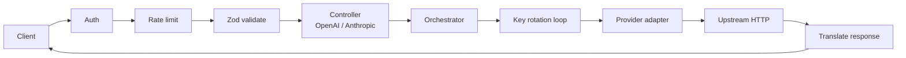

# Waypoint

Waypoint is a single-binary local LLM proxy and gateway. It fronts Google Gemini, Anthropic Claude, OpenAI, Cloudflare Workers AI, OpenRouter, and any OpenAI- or Anthropic-compatible custom provider behind a single OpenAI- and Anthropic-compatible HTTP surface, sharing a pool of API keys per provider with automatic failover and HTTP-status-driven cooldown. One config file, no database, no sidecar.

## At a Glance

- **Multiple providers, one endpoint pool.** Per-provider key pools rotate with `round-robin` or `fill-first` (the latter favors upstream prompt-cache locality).
- **HTTP-status-driven key lifecycle.** `401`/`403` retire a key permanently; `402`/`408`/`429`/`5xx` apply a cooldown (with exponential backoff for `429`); other `4xx` and transport failures leave the key untouched. Keys auto-reactivate when the timer fires.
- **OpenAI and Anthropic ingress.** Tools, multimodal messages, SSE streaming, and `reasoning_content` are normalized through OpenAI as the hub. On OpenAI ingress, `max_tokens` wins over `max_completion_tokens` when both are present.
- **Cross-protocol egress.** Gemini, Anthropic, OpenAI, Cloudflare Workers AI, OpenRouter, and any custom OpenAI- or Anthropic-compatible provider (configured with `baseUrl`).
- **Dry-run.** `/dryrun/openai/*` and `/dryrun/anthropic/*` mirror the live routes and return what would have been sent upstream, without making the call. Requires `logging.logRequests: true`.
- **Per-request audit logs.** When `logging.logRequests: true`, five files per request land under `logging.requestLogPath`: `01_client_request.json`, `02_provider_request.json`, `03_provider_response.json`, `04_client_response.json`, and `05_event_stream.jsonl` (for streaming).
- **Operational telemetry.** `GET /health` returns pool and routing state; `GET /metrics` returns Prometheus text. Both are behind the same bearer-token auth as the protocol routes.
- **Single binary, single config.** One process, one YAML, no DB, no daemon.

## How It Works

A request hits the gateway, is authenticated and rate-limited against a per-client sliding window, validated against the Zod schema for its ingress protocol, and translated into the OpenAI-shaped unified model. The orchestrator picks a key from the provider pool, dispatches to the provider adapter, and on failure rotates to the next key, applies the cooldown policy, and falls back to `fallbackModel` when the pool is exhausted. The upstream response is translated back into the ingress protocol's native shape and returned to the client.



The orchestrator retries on the next available key, applies the cooldown policy on failure, and falls back to `fallbackModel` when the provider pool is exhausted.

## Quickstart

Requires Node.js 24 or newer. Node 24 LTS is the recommended runtime; the CI
matrix also validates against Node 26.

1. Clone, install, copy the example config and env file:

   ```bash
   git clone <repo-url> waypoint
   cd waypoint
   npm install
   cp config.example.yaml config/config.yaml
   cp .env.example .env
   ```

   Fill in the `${...}` placeholders in `.env` with your API keys and client tokens.

2. Start the gateway. `npm run dev` runs under `node --watch` for local development; `npm start` runs the production entry point.

   ```bash
   npm run dev
   ```

3. Sanity-check that the gateway is up:

   ```bash
   curl -sS -H "Authorization: Bearer $OPEN_WEBUI_TOKEN" http://localhost:20128/health
   ```

   Expect a JSON body with a `status` field.

4. Send an OpenAI-shaped request:

   ```bash
   curl -sS http://localhost:20128/openai/v1/chat/completions \
     -H "Authorization: Bearer $OPEN_WEBUI_TOKEN" \
     -H "Content-Type: application/json" \
     -d '{
       "model": "gemini-2.5-pro",
       "messages": [{"role": "user", "content": "Say hi in one word."}]
     }'
   ```

`config.example.yaml` is the authoritative annotated configuration reference; `config/config.yaml` is your live config. Set `WAYPOINT_CONFIG_PATH` to point at any YAML file instead of the default.

## Endpoints

| Method | Path | Notes |
|--------|------|-------|
| `GET`  | `/health` | Bearer-token auth. Returns pool and routing state. |
| `GET`  | `/metrics` | Bearer-token auth. Prometheus text. |
| `GET`  | `/openai/v1/models` (also `/openai/models`) | Bearer-token auth. |
| `POST` | `/openai/v1/chat/completions` (also `/openai/chat/completions`) | Bearer-token auth. Set `"stream": true` for SSE. |
| `GET`  | `/anthropic/v1/models` (also `/anthropic/models`) | Bearer-token auth. |
| `POST` | `/anthropic/v1/messages` (also `/anthropic/messages`) | Bearer-token auth. SSE streaming. |
| `POST` | `/dryrun/openai/...` and `/dryrun/anthropic/...` | Mirror the live routes. `logging.logRequests: true` required. |

## Configuration

Copy `config.example.yaml` to `config/config.yaml` (or point `WAYPOINT_CONFIG_PATH` at any YAML file). `${ENV}` placeholders are resolved from the process environment at boot. The example file is the authoritative reference and is annotated inline; the minimum below is all you need to read it.

```yaml
gateway:
  port: 20128
  cooldown:
    baseSeconds: 30
    maxSeconds: 3600
    serverSeconds: 60
  cors:
    allowedOrigins:
      - "*"

clients:
  - name: "open-webui"
    token: "${OPEN_WEBUI_TOKEN}"
    rateLimit:
      windowMs: 60000
      max: 100

providers:
  gemini:
    keys:
      - "${GEMINI_API_KEY_1}"
    models:
      - id: "gemini-2.5-pro"
        fallbackModel: "openai/gpt-4o"
  local-ollama:
    baseUrl: "http://localhost:11434/v1"
    keys:
      - "dummy-key-required"
    models:
      - id: "llama3"
```

Reserved provider names (`gemini`, `anthropic`, `openai`, `cloudflare`) MUST NOT carry a `type` field; custom providers MUST set `baseUrl`. See `config.example.yaml` for `logging.*` and the full provider schema.

Cloudflare is also a reserved provider. Unlike the other built-ins, each entry in `providers.cloudflare.keys` is an object with both `apiKey` and `accountId`, because the upstream OpenAI-compatible URL is account-scoped.

```yaml
providers:
  cloudflare:
    keys:
      - apiKey: "${CLOUDFLARE_API_KEY_1}"
        accountId: "${CLOUDFLARE_ACCOUNT_ID_1}"
    models:
      - id: "@cf/meta/llama-3.1-8b-instruct"
```

## Key Lifecycle & Cooldown

Key state changes are driven by the upstream's HTTP status code. The upstream's exact `code`, `type`, and `message` are passed through to the client unchanged.

| Upstream status | Key action | Cooldown |
|-----------------|-----------|----------|
| `401` | `retire` | none, never reactivated |
| `403` | `retire` | none, never reactivated |
| `402` | `cooldown` | `Retry-After` if present, else `serverSeconds` |
| `408` | `cooldown` | same as `402` |
| `429` | `cooldown` | `Retry-After` if present, else exponential `baseSeconds * 2^(consecutiveFailures - 1)` capped at `maxSeconds` |
| `5xx` | `cooldown` | `Retry-After` if present, else `serverSeconds` |
| Other `4xx` | `none` | no key-state change — the request was wrong |
| Transport failure (no status) | `none` | no key-state change — the request did not reach the provider |

`401` and `403` retire the key permanently because the credential is bad or the account is denied; subsequent calls skip it. `402`, `408`, `429`, and `5xx` apply a cooldown; the key reactivates when the timer fires. `429` uses exponential backoff starting at `gateway.cooldown.baseSeconds` and doubling on consecutive failures up to `gateway.cooldown.maxSeconds`; a non-zero `Retry-After` header wins when present (a `0` means "retry immediately"). Other `4xx` and transport failures leave the key alone — they reflect a bad request or a network problem, not an unhealthy key.

Full policy details in `src/errors/policy.js` and `src/registry/cooldownTracker.js`.

## Error Envelope

Every client-visible failure uses the v1 envelope under an `error` object. Raw upstream response bodies are **never** returned as the root HTTP body — upstream debugging detail stays in server-side logs only.

```json
{
  "error": {
    "code": "rate_limit_exceeded",
    "upstreamCode": "rate_limit_exceeded",
    "type": "rate_limit_error",
    "message": "Rate limit exceeded.",
    "httpStatus": 429,
    "provider": "openai",
    "retryAfterSeconds": 30
  }
}
```

| Field | Required | Notes |
|-------|----------|-------|
| `code` | yes | Upstream's own error code, copied verbatim. Falls back to the literal `upstream_error` when the upstream supplied none. Stable field for clients that want the raw provider identifier regardless of ingress protocol. |
| `message` | yes | Upstream's own error message, copied verbatim. |
| `httpStatus` | yes | HTTP status returned to the client. For upstream errors this is the upstream's status; for transport failures (no status received) it is `502`. |
| `type` | upstream only | Provider-style category string from the upstream body (e.g. `rate_limit_error`); omitted for gateway and pool errors. |
| `provider` | upstream + pool | Provider name (e.g. `openai`, `anthropic`, `gemini`); omitted for pure gateway faults. |
| `retryAfterSeconds` | when relevant | Seconds until retry is advisable; also sets the `Retry-After` response header. |
| `details` | gateway validation only | Optional array of field-level validation issues. |

The hub format is OpenAI; upstream errors are projected into the ingress protocol's native envelope (`{ error: { ... } }` for OpenAI, `{ type: "error", error: { ... } }` for Anthropic) by `translateError` in `src/transforms/index.js`. Pre-stream failures return the JSON envelope with the upstream's HTTP status; post-stream failures emit an SSE error frame in the ingress protocol's shape and close the stream (HTTP status remains `200`).

For streaming error frame shapes and the per-provider code catalogue, see `src/errors/envelope.js` and `src/transforms/response/`.

## Project Layout

Source and test files are camelCase. `src/` is organized by responsibility:

- `src/app/` — entry, bootstrap, Express app factory, service wiring.
- `src/config/` — YAML loader, validators, env interpolation, cooldown defaults.
- `src/controllers/` — OpenAI and Anthropic protocol controllers.
- `src/domain/` — model resolution, request transformation, model cache.
- `src/errors/` — upstream errors, key-action policy, protocol-specific envelopes.
- `src/lifecycle/` — graceful shutdown and signal handling.
- `src/logging/` — LogTape integration and per-request audit logging.
- `src/middleware/` — auth, rate limiter, Zod validation, dry-run, metrics.
- `src/monitoring/` — in-process Prometheus metrics collector.
- `src/providers/` — provider adapters (Gemini, Anthropic, OpenAI) and the strategy factory.
- `src/registry/` — key pool, key object, cooldown tracker.
- `src/routes/` — OpenAI, Anthropic, health, metrics express routers.
- `src/services/` — orchestrator, retry strategy, key rotation loop, stream guard.
- `src/streaming/` — SSE parser and stream accumulation.
- `src/transforms/` — cross-protocol request/response/error translation.

Tests live in `test/` mirroring `src/`; cross-cutting HTTP tests are in `test/integration/`. See `AGENTS.md` for the full tree and per-directory conventions.

## Development & Testing

Test framework is Vitest 4 with MSW 2 and Supertest 7 (71 test files; coverage thresholds in `vitest.config.js`).

```bash
npm test                  # one-shot vitest run
npm run test:watch        # watch mode
npm run lint              # eslint (flat config in eslint.config.js)
npm run ci                # lint + test
```

`npm run dev` is `node --watch src/index.js`; `npm start` is the production entry point. Override the config path with `WAYPOINT_CONFIG_PATH=path/to/config.yaml`.

## License

MIT. See [LICENSE](./LICENSE).
